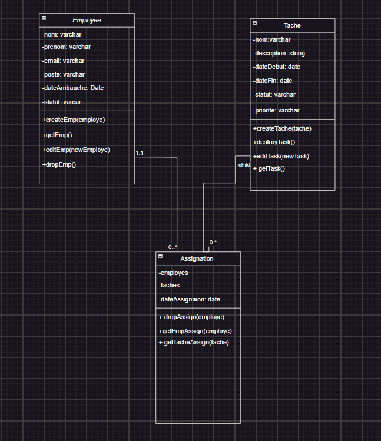

# Gestion de Projet

Ce projet est une application de gestion de projet qui permet de gérer les employés, les tâches, et les assignations entre les employés et les tâches. Il est construit avec Node.js et Express pour fournir une API permettant d'effectuer des opérations CRUD (Créer, Lire, Mettre à jour, Supprimer) sur les employés et les tâches, ainsi que d'assigner et de retirer des tâches pour les employés.

## Structure du Projet

- `Employes.js` : Gestion des employés.
- `Taches.js` : Gestion des tâches.
- `Assignation.js` : Gestion des assignations entre les tâches et les employés.
- `index.js` : Point d'entrée de l'application.

## Prérequis

- [Node.js](https://nodejs.org/) (version 14 ou supérieure)
- [npm](https://www.npmjs.com/) (ou [yarn](https://yarnpkg.com/))

## Installation

1. Clonez le dépôt du projet :

   ```bash
  - git clone <https://github.com/FatimataAliouSall/Composition-metier.git>
  - cd <employee-management>

2.  Installez les dépendances :


    - npm install


##  Utilisation


1.  Démarrez le serveur :

    - npm start


2.  Le serveur sera accessible à l'adresse http://localhost:3000.


##   Auteur

   Fatimata Aliou Sall [https://github.com/FatimataAliouSall/Composition-metier.git]

##   Image du diagremme 


   - 
